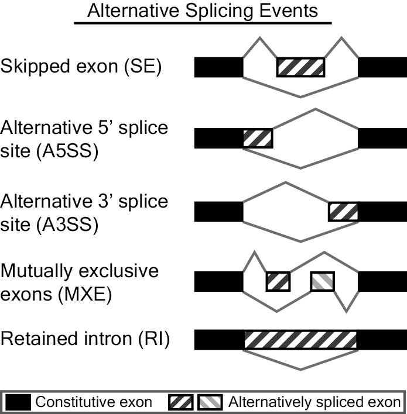

# awesome-alternative-splicing
## What is this?
This is a list of software packages (and the people developing these methods) for alternative splicing. [Contributions welcome](https://github.com/hussainather/awesome-alternative-splicing/blob/master/CONTRIBUTING.md)...

## Types of alternative splicing
 - Skipped exon or cassette exon (SE): An exon can be retained or spliced out of
 the primary transcript.
 - Mutually exclusion exons (MXE): One of two exons is retained in mRNA splicing
, but not both.
 - Alternative 5' splice site (A5SS): An alternative 5' splice junction (donor s
ite) is used that changes the 3' boundary of the upstream exon.
 - Alternative 3' splice site (A3SS): An alternative 3' splice junction (accepto
r site) is used that changes the 5' boundary of the downstream exon.
 - Retained intron (RI): A sequenced may be spliced out as an intron or retained
, and there are no flanking introns.

 
Source: http://rnaseq-mats.sourceforge.net/rmats3.0.9/

## Software packages
+ [flotilla](https://github.com/yeolab/flotilla) - [Python] - reproduce machine learning analysis of gene expression and alternative splicing data.
+ [GMAP](http://research-pub.gene.com/gmap/) - [C++] - detect complex variants and splicing in short reads, SNP-tolerant.
+ [HMMSplicer](http://derisilab.ucsf.edu/index.php?software=105) - [C++] discovery canonical and non-canonical splice junctions in short read datasets.
+ [MapSplice](http://www.netlab.uky.edu/p/bioinfo/MapSplice2) - [C++] - map RNA-seq data to reference genome for splice junction discovery.
+ [outrigger](https://github.com/YeoLab/outrigger) - [Python] - calculate alternative splicing scores of RNA-Seq data based on junction reads and a de novo, custom annotation created with a graph database, especially made for single-cell analyses.
+ [rMATS](http://rnaseq-mats.sourceforge.net/) - [Python] - RNA-Seq Multavariate Analysis of Transcript Splicing. [Reading rMATS output](https://www.biostars.org/p/256949/)
+ [rmats2sashimiplot](https://github.com/Xinglab/rmats2sashimiplot/) - [Python] - visualize rMATS output using sashimi plots.
+ [SingleSplice](https://github.com/jw156605/SingleSplice) - [R, perl, C++] - detect biological variation in alternative splicing within a population of single cells. 
+ [SpliceMap](https://web.stanford.edu/group/wonglab/SpliceMap/) - [C++] - discover and align splice junctions for RNA-Seq reads.
+ [STAR](https://code.google.com/archive/p/rna-star/) - identify alternative splicing.
+ [TopHat](http://ccb.jhu.edu/software/tophat/index.shtml) [C++] - map splice junctions for RNA-Seq reads.
